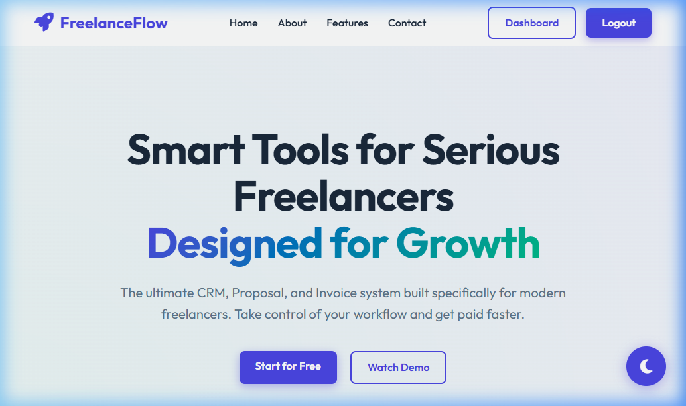
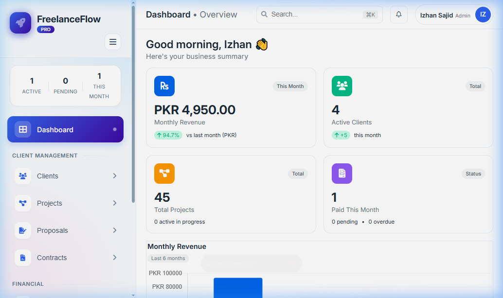
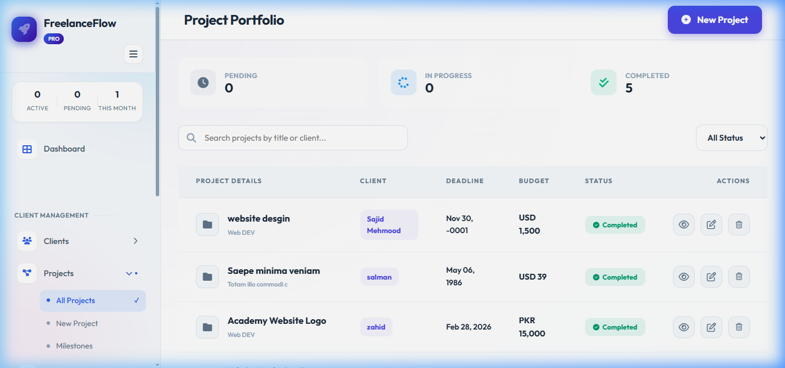
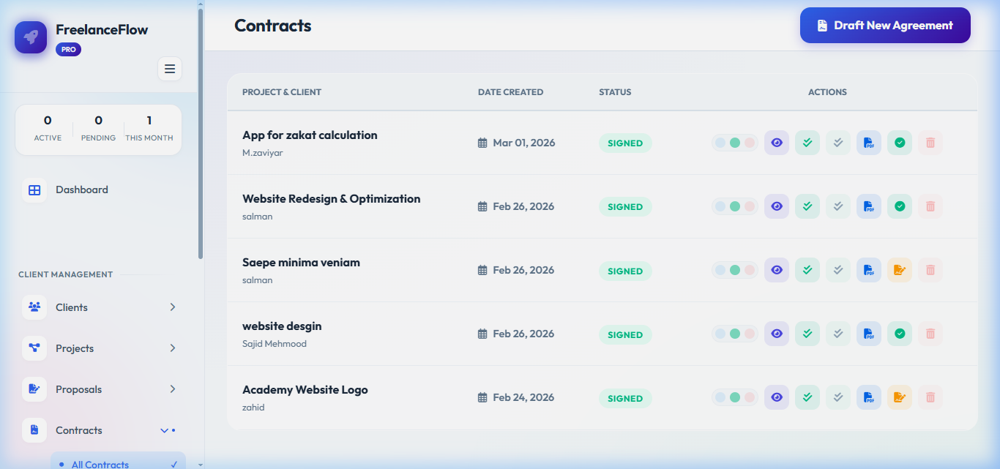
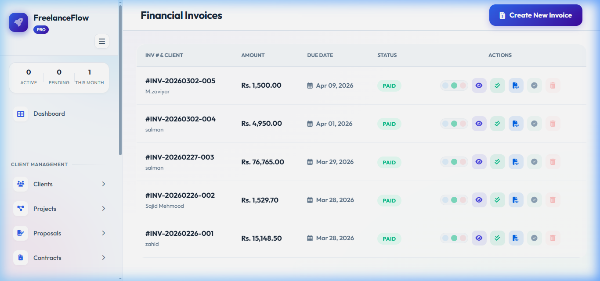

# Freelance Flow 🚀

**Freelance Flow** is a premium, all-in-one business management platform designed specifically for freelancers. It streamlines everything from project initiation to final payment, ensuring you spend less time on paperwork and more time on what you do best.



## 🎥 Project Demo
Check out the platform in action!

> [!TIP]
> **[📥 Download Demo Video (WebP Format)](assets/readme/project_demo.webp)**

## ✨ Core Features

### 📊 Intelligent Dashboard
Get a high-level overview of your business health. Track active projects, pending invoices, and total earnings with beautiful, glassmorphic analytics.


### 📁 Project Management
Track your project lifecycles with ease. Set budgets, deadlines, and milestones. All financial data is synchronized across the platform.


### 📜 Proposals & Contracts
*   **Smart Proposals**: Generate professional proposals with project-linked data.
*   **Legal Contracts**: Create PDF agreements instantly. Send them via automated emails and track their status.
*   **Secure Uploads**: Upload signed copies directly. Once signed, contracts are locked to prevent unauthorized changes.


### 🧾 Financial Suite (Invoices & Payments)
*   **Automated Invoicing**: Create invoices that pull data directly from your projects. Includes automatic tax calculation and smart due-date suggestions.
*   **Payment Tracking**: Record payments with multi-currency support (PKR, USD, GBP).
*   **Cascading Selection**: Intelligent forms that filter projects and invoices based on the selected client.


### 📧 Email Automations
Automated email reminders for project milestones, contract signatures, and invoice due dates using PHPMailer and SMTP integration.

## 🛠️ Tech Stack

*   **Backend**: PHP 8.x
*   **Database**: MySQL (PDO)
*   **Frontend**: HTML5, Vanilla CSS3 (Glassmorphism), JavaScript (ES6+)
*   **Libraries**:
    *   **FontAwesome**: Modern iconography
    *   **Google Fonts**: Outfit & Inter for premium typography
    *   **dompdf**: High-fidelity PDF generation
    *   **PHPMailer**: Robust email delivery system

## 🚀 Installation & Setup

1.  **Clone the Repository**:
    ```bash
    git clone https://github.com/izhansajiddeveloper/freelance-flow.git
    ```
2.  **Database Migration**:
    *   Import the provided database schema (found in `config/db.php` logic or `.sql` export).
    *   Configure your database credentials in `config/db.php`.
3.  **Environment Setup**:
    *   Update `BASE_URL` in `config/config.php` to match your local setup (e.g., `http://localhost/freelance-flow/`).
    *   Configure SMTP settings in `config/config.php` for email functionality.
4.  **Run Locally**:
    *   Move the folder to your `htdocs` (XAMPP) or `www` (WAMP) directory.
    *   Access via `http://localhost/freelance-flow/`.

## 🎨 Design Philosophy
The application features a modern **Glassmorphic** design system, utilizing vibrant gradients, subtle blurs, and premium animations to provide an interface that feels both powerful and alive.

---
*Developed with ❤️ for the Freelance Community.*
